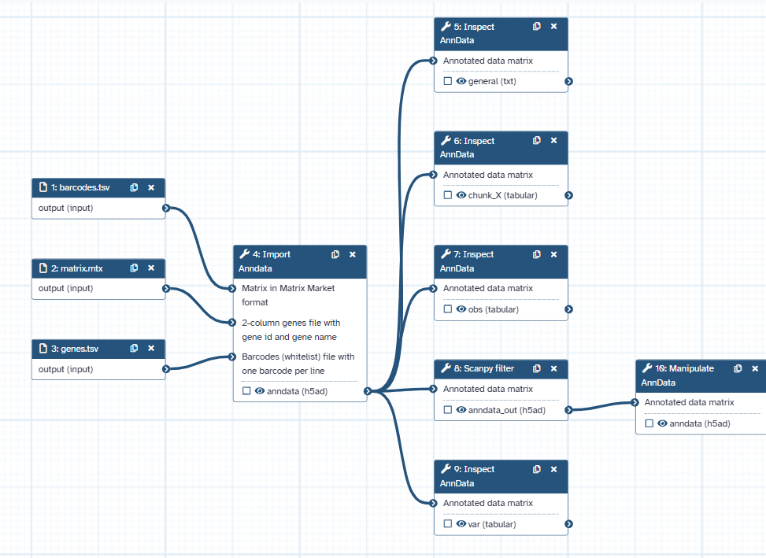
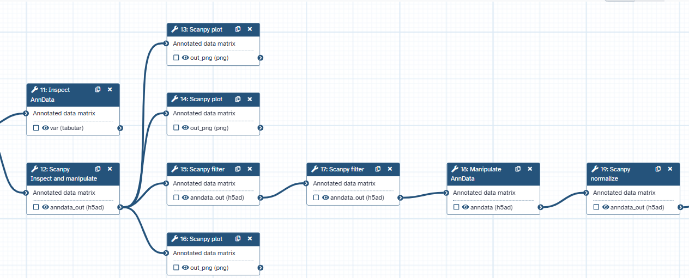
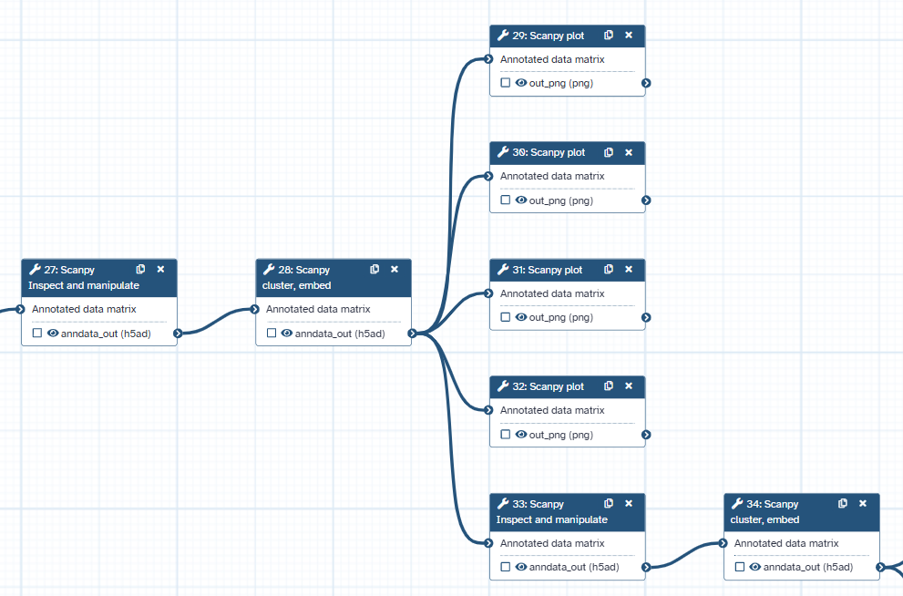
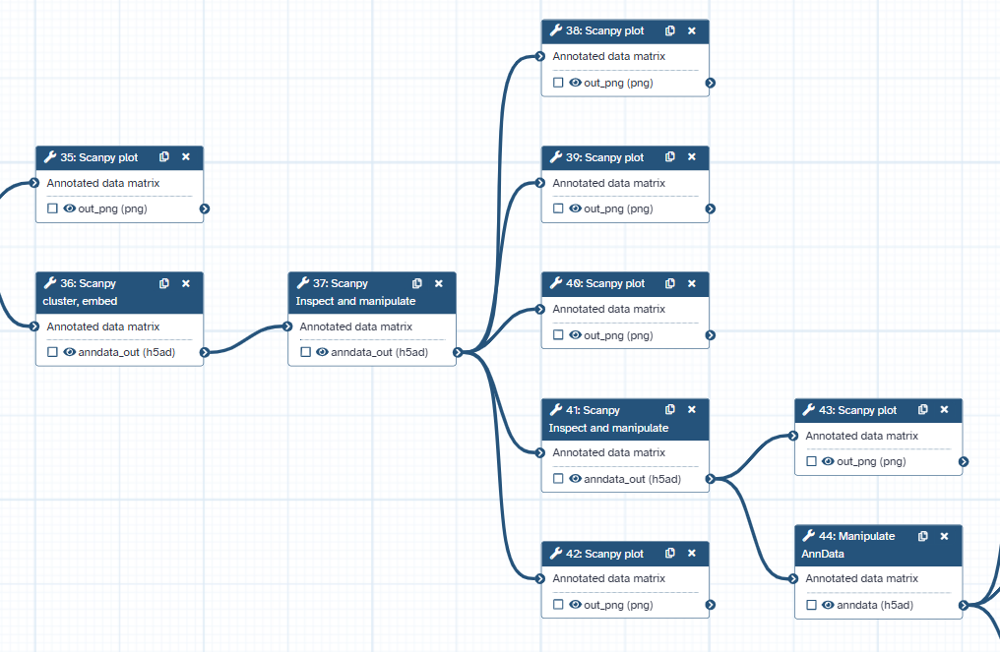
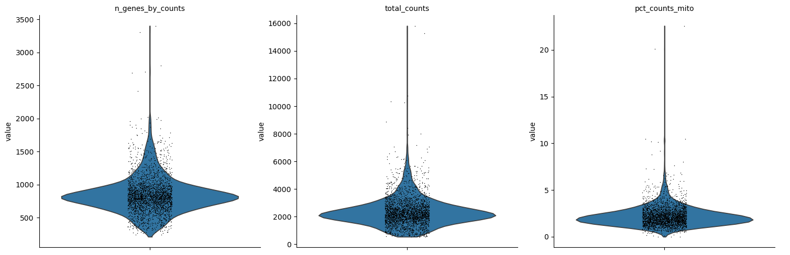
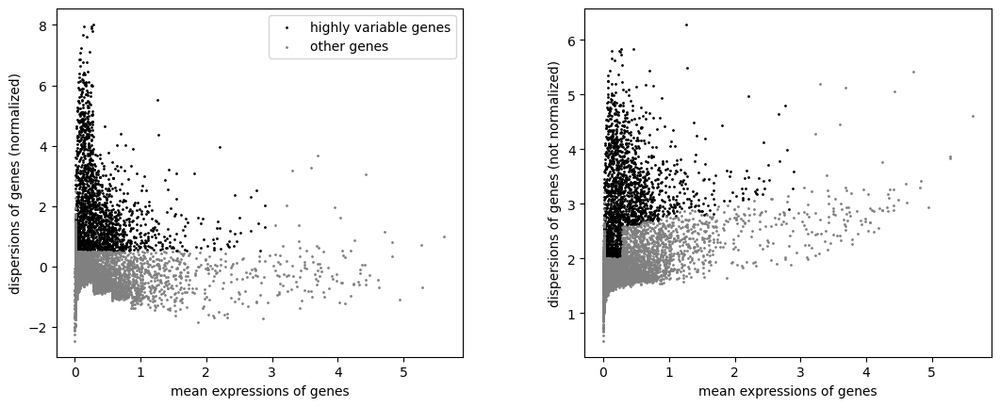
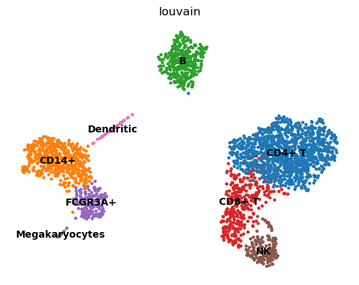
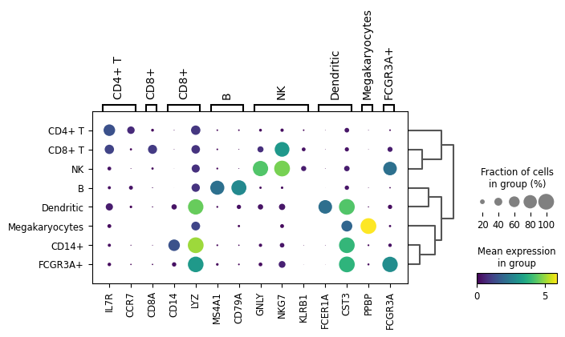

# Cloud-Based, Reproducible scRNA-Seq Processing & Topological Clustering of 3k Mononuclear Immune Cells

## 🔬 Project Overview & Computational Rationale
This repository demonstrates a fully reproducible, end-to-end cloud computing pipeline deployed on the **Galaxy Single Cell Omics** platform to process, QC, and cluster **3,000 Peripheral Blood Mononuclear Cells (PBMCs)** derived from 10X Genomics sequencing hardware. 

By leveraging the **Scanpy** framework embedded within automated cloud modules, this project addresses a core bottleneck in single-cell bioinformatics: establishing reproducible, scalable pipelines that transition raw, unaligned transcript counts into distinct, biologically interpretable cellular landscapes.

---

## 🛠️ Pipeline Architecture & Methodology

The pipeline translates raw data inputs into clean, annotated cellular clusters through sequential, structured tool blocks. The complete layout of our deployed Galaxy pipeline is mapped below across consecutive execution segments:

### Pipeline Execution Segments:
* **Phase 1: Data Ingestion & Initial Matrix Alignment**
  
* **Phase 2: Data Preprocessing & Target Normalization**
  
* **Phase 3: Feature Variance Identification (HVG Extraction)**
  
* **Phase 4: Linear Dimensionality Reduction (PCA Matrices)**
  
* **Phase 5: Neighborhood Graph Assembly & UMAP Projection**
  

### 1. Data Ingestion & AnnData Structuring
Raw cell-matrix arrays (`matrix.mtx`, `genes.tsv`, `barcodes.tsv`) are ingested and parsed into an integrated, compressed `AnnData` object, initializing the coordinate matrices ($E \in \mathbb{R}^{C \times G}$) for efficient downstream computing.

### 2. Rigorous Transcriptomic Quality Control (QC)
Low-quality barcodes, broken cells, and multi-cell doublets are filtered out using robust statistical cutoffs to remove technical artifacts:
* **Mitochondrial Expression Fraction ($MT\%$):** Barcodes displaying outliers in mitochondrial transcripts are eliminated to exclude apoptotic or lysed cells with ruptured plasma membranes.
* **Minimum / Maximum Gene Count Filters:** Cellular inputs displaying $< 200$ unique genes are scrubbed to eliminate ambient RNA noise, while uncharacteristically high counts are filtered to omit potential doublets.

### 3. Library Size Normalization & Variance Identification
To control for variable sequencing depth across droplets, total counts per cell are normalized to a constant target scale ($10,000$ counts per cell) and subsequently log-transformed ($ln(counts + 1)$). 
* **Feature Selection:** We calculated highly variable genes (HVGs) based on their mean expression versus dispersion ratios, locking down the key genes responsible for driving actual biological variation while eliminating invariant background noise.

### 4. Dimensionality Reduction & Graph Topology
* **Linear Space Compression:** Principal Component Analysis (PCA) is performed on the scaled HVG matrix to reduce dimensions while preserving the highest possible variance eigenvectors.
* **Topological Embedding:** Using the top primary components, a $k$-nearest neighbor ($k$-NN) graph is constructed. This structural grid is projected into a 2D coordinate space via **Unified Manifold Approximation and Projection (UMAP)** for clean visual interpretation.

---

## 📊 Core Analytical End-Points

### 1. High-Resolution Single-Cell Quality Verification
The violin plots below demonstrate the structural integrity of the cell populations post-filtration, showing healthy distributions of unique molecular identifiers (UMIs) alongside cleanly controlled mitochondrial transcript percentages.

### 2. Feature Variance Distribution
This scatter plot highlights the distribution of highly variable genes, identifying the exact genetic factors that separate immune populations before graph construction.

### 3. Unsupervised Neighborhood Clustering & Visual Landscape
Our localized density matrices isolate clear, independent cluster separations among peripheral mononuclear blood populations, highlighting distinct topological groupings within the standard immune landscape.

### 4. Transcriptomic Fingerprinting via Marker Expression
To validate our automated clusters, a downstream differential expression profile tracks the precise expression intensity of classical marker genes across isolated clusters, allowing for accurate cell-type identification.

---

## 🚀 Pipeline Replication & Computational Portability
This workflow is structured for complete computational portability, allowing researchers to replicate the exact analysis and dataset endpoints in under 5 minutes without requiring local package installations:

1. Navigate to the `/workflows/` directory inside this repository and download the system file: `Clustering_3K_PBMCs_with_Scanpy.ga`.
2. Access the public cloud infrastructure at the [Galaxy Single Cell Hub](https://usegalaxy.org).
3. From the top taskbar, select **Workflow** -> **Import**, and drag-and-drop the downloaded `.ga` blueprint.
4. Inject standard public 3k PBMC matrix parameters to execute the automated graph architecture smoothly end-to-end.
